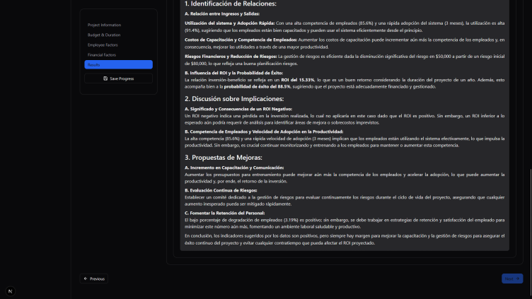

# ROI Calculator

Welcome to the **ROI Calculator** project! This application is designed to help businesses calculate their Return on Investment (ROI) by analyzing various metrics and providing actionable recommendations. It combines a modern frontend with a robust backend to deliver accurate and insightful results.

---

## 🚀 Features

- **ROI Calculation**: Analyze key metrics such as budget, employee competence, and productivity savings to calculate ROI.
- **Actionable Recommendations**: Leverages AI to provide tailored recommendations based on project data.
- **Interactive Frontend**: Built with Next.js for a seamless user experience.
- **Scalable Backend**: Powered by Flask and Azure Functions for efficient data processing.
- **Cloud Integration**: Supports Azure Blob Storage for secure file management.

---
## 📊 How It Works

1. **Input Data**: Users provide project details such as budget, employee count, and training costs.
2. **Metrics Calculation**: The backend processes the data to compute:
   - Employee Demotion Percentage
   - Success Probability Percentage
   - ROI Percentage
3. **AI Recommendations**: Based on the metrics, the system generates actionable insights to improve ROI.
4. **Results Display**: The frontend presents the results in an intuitive and interactive format.

---

## 🖥️ Getting Started

### Prerequisites
- **Node.js** (v16 or higher)
- **Python** (v3.8 or higher)
- **Azure CLI** (for cloud integration)

### Installation

1. Clone the repository:
   ```bash
   git clone https://github.com/your-username/roi-calculator.git
   cd roi-calculator
   ```

2. Install dependencies for the frontend:
   ```bash
   cd frontend-nextjs
   npm install
   ```

3. Install dependencies for the backend:
   ```bash
   cd ../backend
   pip install -r requirements.txt
   ```

---

## 🔧 Usage

### Frontend
1. Start the development server:
   ```bash
   cd frontend-nextjs
   npm run dev
   ```
2. Open [http://localhost:3000](http://localhost:3000) in your browser.

### Backend
1. Run the Flask server:
   ```bash
   cd backend
   python app.py
   ```
2. The API will be available at [http://localhost:5000](http://localhost:5000).

### Azure Functions
1. Start the Azure Functions runtime:
   ```bash
   cd backend
   func start
   ```

---

## 📂 Project Structure

```
roi-calculator/
├── frontend-nextjs/       # Frontend application
│   ├── pages/             # Next.js pages
│   ├── components/        # Reusable UI components
│   └── public/            # Static assets
├── backend/               # Backend application
│   ├── services/          # Business logic and utilities
│   ├── app.py             # Flask API
│   └── function_app.py    # Azure Functions
└── README.md              # Project documentation
```

---

## 🌟 Value Proposition

- **Efficiency**: Automates ROI calculations, saving time and reducing errors.
- **Insights**: Provides data-driven recommendations to optimize business decisions.
- **Scalability**: Designed to handle large datasets and integrate with cloud services.
- **User-Friendly**: Intuitive interface for both technical and non-technical users.

---

### Configuración y Uso




---

# Azure Architecture for ROI Calculator

## Overview

This architecture represents the **ROI Calculator** application deployed in **Azure**, integrating multiple services including **App Service, Machine Learning Workspace, Storage Accounts, and Key Vaults**.

## Architecture Diagram


## Components

### 1. **AI & Machine Learning Services**
   - **analizadores-gpt**: Azure AI service for text analysis.
   - **equipo2workspace**: Azure Machine Learning Workspace to handle ML experiments and models.

### 2. **Application Monitoring & Insights**
   - **Application Insights Smart D...**: A monitoring tool for tracking application performance.
   - **equipo2workspa0868321380**: Application Insights instance for tracking logs.
   - **equipo2workspa0452963102**: Log Analytics workspace for storing logs.

### 3. **Security & Key Management**
   - **miappdevkv**: Key Vault for securely storing secrets and credentials.
   - **equipo22410257976**: Another Key Vault for encryption keys.
   - **roi-calculator-id-9111** & **roi-calculator-id-ba56**: Managed identities for authentication.

### 4. **Storage Accounts**
   - **equipo28026829374**: Primary storage account for application data.
   - **equipo2workspa5367332377**: Additional storage linked to ML workspace.
   - **equipo286bc2** & **roistoragehack**: Extra storage solutions.

### 5. **Application Deployment**
   - **roi-calculator**: Main App Service where the ROI Calculator is hosted.
   - **ASP-equipo2-8514**: The App Service Plan providing computing resources.

## Deployment Methodology

1. **Infrastructure as Code (IaC)**: Deployed using ARM templates or Terraform.
2. **CI/CD Integration**: Uses **Azure DevOps Pipelines** for automated deployment.
3. **Security Best Practices**:
   - Secrets stored in **Azure Key Vault**.
   - Role-based access control (RBAC) implemented for all resources.
4. **Monitoring & Logging**:
   - **Application Insights** for performance tracking.
   - **Log Analytics** for detailed logs.

---

This architecture ensures **scalability, security, and high availability** for the ROI Calculator application.

## 📚 Learn More

- [Next.js Documentation](https://nextjs.org/docs)
- [Flask Documentation](https://flask.palletsprojects.com)
- [Azure Functions Documentation](https://learn.microsoft.com/en-us/azure/azure-functions/)

---

## 🤝 Contributing

We welcome contributions! Please follow these steps:
1. Fork the repository.
2. Create a new branch: `git checkout -b feature-name`.
3. Commit your changes: `git commit -m "Add feature-name"`.
4. Push to the branch: `git push origin feature-name`.
5. Submit a pull request.

---

## 📄 License

This project is licensed under the MIT License. See the [LICENSE](LICENSE) file for details.

---

## 📧 Contact

For questions or feedback, please reach out to [your-email@example.com](mailto:your-email@example.com).

